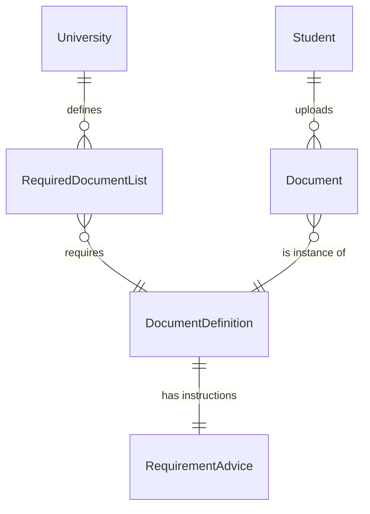

# Database Schema Design: Document Upload Module

**Status:** Draft
**Date:** 2026-01-01
**Author:** Winston (Systems Architect)

## Overview
This schema update introduces a structured document management system, decoupled from generic "Tasks". It supports the rigorous validation requirements defined in the PRD.

## ER Diagram (Conceptual)



## SQL Schema Definition (PostgreSQL)

### 1. Document Dictionaries

```sql
-- Master list of all possible document types (Passport, Diploma, etc.)
CREATE TABLE document_definitions (
    id UUID PRIMARY KEY DEFAULT uuid_generate_v4(),
    code VARCHAR(50) UNIQUE NOT NULL, -- e.g., 'PASSPORT', 'DIPLOMA_APOSTILLE'
    name VARCHAR(255) NOT NULL,
    description TEXT,
    created_at TIMESTAMP DEFAULT NOW()
);

-- User guidance text linked to definitions (1:1)
CREATE TABLE requirement_advice (
    id UUID PRIMARY KEY DEFAULT uuid_generate_v4(),
    document_definition_id UUID UNIQUE REFERENCES document_definitions(id) ON DELETE CASCADE,
    advice_text TEXT NOT NULL,       -- "Where to get it..."
    validation_checklist JSONB,      -- ["Check stamp", "Check corners"]
    ui_hint TEXT,                    -- Tooltip for upload modal
    typical_error_text TEXT,         -- "Rejection usually caused by..."
    updated_at TIMESTAMP DEFAULT NOW()
);
```

### 2. Requirements Mapping

```sql
-- Junction table defining what a University requires
CREATE TABLE required_document_list (
    id UUID PRIMARY KEY DEFAULT uuid_generate_v4(),
    university_id UUID REFERENCES universities(id) ON DELETE CASCADE,
    document_definition_id UUID REFERENCES document_definitions(id) ON DELETE CASCADE,
    is_mandatory BOOLEAN DEFAULT TRUE,
    UNIQUE(university_id, document_definition_id)
);
```

### 3. Student Documents

```sql
-- Actual files uploaded by students
CREATE TABLE documents (
    id UUID PRIMARY KEY DEFAULT uuid_generate_v4(),
    student_id UUID REFERENCES students(id) ON DELETE CASCADE, -- Assuming 'students' table exists
    document_definition_id UUID REFERENCES document_definitions(id),
    
    file_url VARCHAR(512),
    status VARCHAR(20) DEFAULT 'PENDING' CHECK (status IN ('PENDING', 'ON_CHECK', 'NEEDS_FIX', 'ACCEPTED')),
    
    -- New fields requested
    rejection_reason TEXT,           -- Comment from curator if rejected
    metadata JSONB,                  -- Stores parsed info (e.g., Apostille number, Issue Date)
    
    uploaded_at TIMESTAMP,
    reviewed_at TIMESTAMP,
    created_at TIMESTAMP DEFAULT NOW(),
    updated_at TIMESTAMP DEFAULT NOW()
);
```

## TypeORM Entities Draft

### DocumentDefinition Entity
```typescript
@Entity('document_definitions')
export class DocumentDefinition {
  @PrimaryGeneratedColumn('uuid')
  id: string;

  @Column({ unique: true })
  code: string; // e.g. 'PASSPORT'

  @Column()
  name: string;

  @OneToOne(() => RequirementAdvice, advice => advice.definition)
  advice: RequirementAdvice;
}
```

### RequirementAdvice Entity
```typescript
@Entity('requirement_advice')
export class RequirementAdvice {
  @PrimaryGeneratedColumn('uuid')
  id: string;

  @Column('text')
  adviceText: string;

  @Column('jsonb')
  validationChecklist: string[];

  @Column('text')
  uiHint: string;

  @Column('text', { nullable: true })
  typicalErrorText: string;

  @OneToOne(() => DocumentDefinition, def => def.advice)
  @JoinColumn()
  definition: DocumentDefinition;
}
```

### Document Entity
```typescript
@Entity('documents')
export class Document {
  @PrimaryGeneratedColumn('uuid')
  id: string;

  @ManyToOne(() => Student)
  student: Student;

  @ManyToOne(() => DocumentDefinition)
  definition: DocumentDefinition;

  @Column({ nullable: true })
  fileUrl: string;

  @Column({
    type: 'enum',
    enum: ['PENDING', 'ON_CHECK', 'NEEDS_FIX', 'ACCEPTED'],
    default: 'PENDING'
  })
  status: string;

  @Column('text', { nullable: true })
  rejectionReason: string;

  @Column('jsonb', { nullable: true })
  metadata: Record<string, any>;
}
```

## Migration Plan

1.  Create `document_definitions` and populate with the 8 types from PRD.
2.  Create `requirement_advice` and populate content from `prd-document-upload.md`.
3.  Migrate existing file URLs from `tasks.submission` to `documents` table (if data exists).
4.  Update API to read/write to `documents` table for the file management module.
